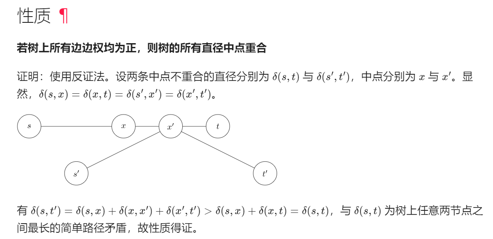
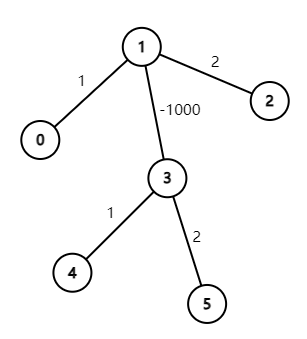

### 树形dp-使用oi wiki中求树的直径的方式
参考：
* [宫水三叶题解](https://leetcode.cn/problems/minimum-height-trees/solutions/1397905/by-ac_oier-7xio/)

* [官方题解](https://leetcode.cn/problems/minimum-height-trees/solutions/1395249/zui-xiao-gao-du-shu-by-leetcode-solution-6v6f/)

* [oi wiki 树的直径](https://oi-wiki.org/graph/tree-diameter/)

前言: 在阅读了宫水三叶题解和官方题解之后，了解到这题的背景是求树的直径，于是去补充阅读了oi wiki上树的直径的内容，发现oi wiki上求树的直径的树形dp方式与宫水三叶题解的树形dp有些不同，oi wiki上相应的树形dp求解此题思路会更简单，因此进行记录。

宫水三叶题解的思路是更直接的，脱离树的直径背景的，考虑每个节点作为根，当从一个根切换到另一个根时如何快速求出换根之后的树高。但当我们已知本题是要求树中相距最远节点时，则可以直接使用oi wiki上的树形dp思路。

oi wiki上的思路是: 

只需要记录以某一节点为根时，每个节点向下，在各子树中的最大长度和次大长度(非严格小于意义下的次大)，然后相加能取到的最大值即为直径长度。

正确性：这样做一定不会错过直径，对于每个节点，算法考虑了其向下走的最长路径。虽然没考虑从这个节点往上走的路径，但是这样的路径会在那些上面节点往下时找出。

或者说，若假定当前节点为路径中的最高节点，则最长路径应该是其往下走的最大长度和次大长度之和，算法考虑了所有节点成为最高节点的情况。这里要分子树是为了保证路径是简单路径，走同一颗子树前面的节点是重合的，剔除重合节点后，那条路径是更下层的子问题。

**这种思路的关键点在于**，可以避免宫水三叶题解中从u到fa这种往上走的情况，只用单纯考虑往下。

而要求直径上所有节点，则可以通过在往下的过程中，记录取到最大长度和次大长度的子树根节点即可。

代码:
```Java
class Solution {
    public List<Integer> findMinHeightTrees(int n, int[][] edges) {
        List<List<Integer>> graph = new ArrayList<>();
        for (int i = 0; i < n; i++) {
            graph.add(new ArrayList<>());
        }
        for (int[] edge : edges) {
            graph.get(edge[0]).add(edge[1]);
            graph.get(edge[1]).add(edge[0]);
        }
        int[] dis1 = new int[n]; // 记录往下走的最大长度
        int[] dis2 = new int[n]; // 记录往下走的次大长度
        int[] sub1 = new int[n]; // 记录取最大值的子树根节点
        Arrays.fill(sub1, -1);
        int[] sub2 = new int[n]; // 记录取次大值的子树根节点
        Arrays.fill(sub2, -1);
        dfs(graph, 0, -1, dis1, dis2, sub1, sub2); // 选0号节点作为根
        int diameter = 0;
        int node = 0; // 在以0号节点为根的树中，最长路径对应的子树根
        for (int i = 0; i < n; i++) {
            if (dis1[i] + dis2[i] > diameter) {
                diameter = dis1[i] + dis2[i];
                node = i;
            }
        }
        List<Integer> path1 = new ArrayList<>();
        List<Integer> path2 = new ArrayList<>();
        int x = sub1[node];
        while (x != -1) {
            path1.add(x);
            x = sub1[x];
        }
        int y = sub2[node];
        while (y != -1) {
            path2.add(y);
            y = sub1[y]; // 注意这里是要用sub1往下走
        }
        List<Integer> path = new ArrayList<>();
        Collections.reverse(path1);
        for (int pathNode : path1) path.add(pathNode);
        path.add(node);
        for (int pathNode : path2) path.add(pathNode);
        List<Integer> ans = new ArrayList<>();
        int size = path.size();
        if (size % 2 == 0) {
            ans.add(path.get(size / 2 - 1));
            ans.add(path.get(size / 2));
        }
        else ans.add(path.get(size / 2));
        return ans;
    }

    private void dfs(List<List<Integer>> graph, int root, int fa, int[] dis1, int[] dis2, int[] sub1, int[] sub2) {
        for (int neighbor : graph.get(root)) {
            if (neighbor != fa) {
                dfs(graph, neighbor, root, dis1, dis2, sub1, sub2);
                int dis = 1 + dis1[neighbor];
                if (dis > dis1[root]) {
                    dis2[root] = dis1[root];
                    sub2[root] = sub1[root];
                    dis1[root] = dis;
                    sub1[root] = neighbor;
                }
                else if (dis > dis2[root]) {
                    dis2[root] = dis;
                    sub2[root] = neighbor;
                }
            }
        }
    }
}
```
时间复杂度: O(n)

空间复杂度: O(n)

此外，官方题解并没有考虑所有相距最远节点对，只考虑了一对就可以。原因应该是这样：

假设存在u，v，其与x，y同为相距最远节点对，则u，v路径的正中节点(一个或两个)一定与x，y的正中节点相同。

证明：
    
考虑以x，y正中节点为根的树，树中任意两点u，v的唯一那条简单路径应该是从u到二者的最近公共祖先lca(u,v)再到v，即u - lca(u,v) - v。

由[树的定义](https://oi-wiki.org/graph/tree-basic/)，任意两点之间的简单路径只有一条，以某一节点为根时，能找出一条路径u - lca(u,v) - v，那么以任意节点为根时的路径u - lca(u,v) - v都是相同的(路径相同，但不同根时lca不同)。

现在只以x，y只有一个正中节点r的情况为例，**考虑以r为根的树**，类似官方题解的第二个结论的证明过程：u，v的路径必须经过r(也就说明在树r中lca(u,v)是r)，否则u，v之间的距离不够。

现在证明u，v的正中节点也一定是r，由于u，v的路径经过r，则说明u，v位于r的两侧，同时x，y也位于r的两侧，不妨设u与x在同一侧。则x,y和u,v的路径为x...r...y和u...r...v，这里设路径x...r和u...r分别为p1，p2，r...y和r...v分别为q1，q2。则有|p1|=|p2|，|q1|=|q2|，若不然，则p1，p2中的较大者p和q1，q2中的较大者q构成的路径pq将会是更长的路径(容易看出这里pq一定是简单路径，因为p，q分列r的两边，节点无重合，且p，q各自是简单路径，则pq也是简单路径)，与x，y和u，v同为最长路径矛盾。这里由于r是正中节点，则|p1|=|q1|，其实是有|p1|=|p2|=|q1|=|q2|的。

综上，即便有多条最长路径，其正中节点一定相同，只用考虑一条即可，同时也有结论，ans的size只会是1或2。

补充：

发现oi wiki上树的直径章节末尾是有这个[结论](https://oi-wiki.org/graph/tree-diameter/#%E6%80%A7%E8%B4%A8)的：

若树上所有边边权均为正，则树的所有直径中点重合



但是感觉写得不太清楚，这里s->x->x'->t'不一定是简单路径，因为简单路径组合的结果不一定是简单路径，证明没有讨论这一点。

不管oi wiki上这个证明了，我的证明过程，哪里隐含默认了**所有边边权为正**这一条件？

应该是在"u，v的路径必须经过r"这里，以这个图为例(树根r是1号节点)：



0-1-2和4-3-5都是直径，但4-3-5并不经过1号节点。

上面我的证明只考虑了树边无权重，也即树边权重全为1的情况，若是oi wiki结论中的树边边权均为正的情况又如何？

这时"直径中点"便不好定义了，这里仅以**直径x,y中间存在一点r，使得路径x,r和r,y的权重和相等的前提下**，证明所有直径都会以r为中点。

树边权重均正，则又会有u，v的路径必须经过r，因为由于(x, y)是直径，则x, y是根r的最高和次高(非严格小于意义下的次高，这里的高是指路径权重和，不是直接的树高)的两棵子树中最深的叶子节点，若u，v的路径不经过r，则说明u，v都在r的某一棵子树中，设u比v更深(这里的深是指到r的权重和大，不是直接的深度)，再设x比y深，由于边权重均正，则：

情况一：u,v同在x所属的子树中

设x在r的子树c1中，y在r的子树c2中。则δ(u,v) <= 2h(c1)，而δ(x,y) = h(c1) + δ(c1,r) + δ(r,c2) + h(c2)，由前提h(c1) + δ(c1,r) == δ(r,c2) + h(c2)，则δ(x,y) = 2 * (h(c1) + δ(c1,r)) > 2h(c1) >= δ(u,v)。与u,v和x,y同为直径矛盾，因此u,v不可能同在x所属的子树中，这种情况不可能。

这里δ(c1,r) > 0依赖了边权为正。

情况二：u,v同在y所属的子树中

同理，这种情况不可能。

情况三: u,v同在x，y所属的子树以外的子树中

x->r->lca(u,v)->u(这种情况下这是简单路径)的权重和会比直径v->lca(u,v)->u更大，矛盾。因此u，v的路径必须经过r，然后接着又会有|p1|=|p2|=|q1|=|q2|，则所有直径都会以r为中点。

这里推出x->r->lca(u,v)->u的权重和会比直径v->lca(u,v)->u更大的关键点在于若r!=lca(u,v)，则x->r->lca(u,v)一定严格大于v->lca(u,v)，因为`v->lca(u,v)` < `v->lca(u,v)->r` <= `x->r` < `x->r->lca(u,v)`，这依赖于边权为正，`r-lca(u,v)`严格大于0。

综上，在所述前提下，所有直径都经过r且以r为中点。

同时，这也能看出结论中的前提树上所有边边权均为正不能改成树上所有边边权均非负，例如一个边权全为0，三层的满二叉树就是反例。