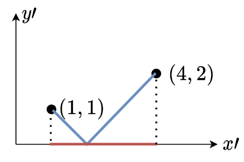

平面上两点$(x_1, y_1)$, $(x_2, y_2)$

曼哈顿距离的定义: $d = |x_1 - x_2| + |y_1 - y_2|$

切比雪夫距离的定义: $d = max(|x_1 - x_2|, |y_1 - y_2|)$

参考：

* [oi wiki的证明](https://oi-wiki.org/geometry/distance/#%E8%AF%81%E6%98%8E)

* [灵茶山艾府题解](https://leetcode.cn/problems/minimize-manhattan-distances/solutions/2716755/tu-jie-man-ha-dun-ju-chi-heng-deng-shi-b-op84/)

### 曼哈顿距离转切比雪夫距离

曼哈顿距离转切比雪夫距离:

$|x_1 - x_2| + |y_1 - y_2|$

= (拆绝对值)

$max(x_1 - x_2 + y_1 - y_2, x_1 - x_2 - y_1 + y_2, -x_1 + x_2 + y_1 - y_2, -x_1 + x_2 - y_1 + y_2)$

= (4种情况合并为2对)

$max(|(x_1 + y_1) - (x_2 + y_2)|, |(x_1 - y_1) - (x_2 - y_2)|)$

相当于每一个点$(x, y)$转换为$(x', y') = (x + y, x - y)$, 新坐标系下的切比雪夫距离即为原坐标系下的曼哈顿距离。

也可以看灵茶山艾府题解中的这两个图:

将坐标轴顺时针旋转45°，分两种情形可以看到，曼哈顿距离$|x_1 - x_2| + |y_1 - y_2| = \sqrt{2}max(|x_1' - x_2'|, |y_1' - y_2'|)$

这里$x',y'$是顺时针旋转45°的变换，

$x = \rho cos\theta$

$y = \rho sin\theta$

$x' = \rho cos(\theta + \frac{\pi}{4})$

$y' = \rho sin(\theta + \frac{\pi}{4})$

解之得到

$x' = \frac{\sqrt{2}}{2}(x - y)$

$y' = \frac{\sqrt{2}}{2}(x + y)$

再带回上面也可以得到

$|x_1 - x_2| + |y_1 - y_2| = max(|(x_1 + y_1) - (x_2 + y_2)|, |(x_1 - y_1) - (x_2 - y_2)|)$

### 切比雪夫距离转曼哈顿距离

反过来，切比雪夫距离转曼哈顿距离（将曼哈顿转切比雪夫的式子反过来代换一下）:

$max(|x_1 - x_2|, |y_1 - y_2|)$ = $|\frac{x_1 + y_1}{2} - \frac{x_2 + y_2}{2}| + |\frac{x_1 - y_1}{2} - \frac{x_2 - y_2}{2}|$

即$(x_1, y_1), (x_2, y_2)$的切比雪夫距离为$(\frac{x_1 + y_1}{2}, \frac{x_1 - y_1}{2}),(\frac{x_2 + y_2}{2}, \frac{x_2 - y_2}{2})$的曼哈顿距离。
