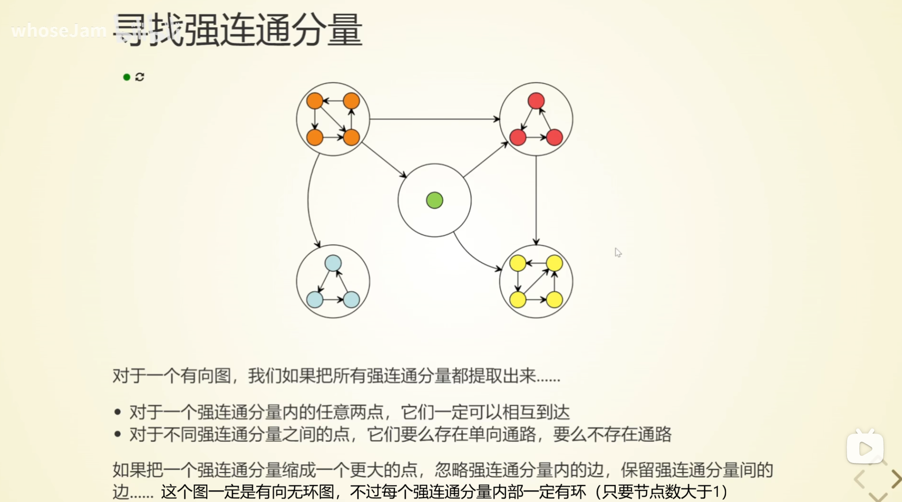

参考: 

* https://oi-wiki.org/graph/scc/

* https://www.bilibili.com/video/BV162U6YCE7o/

强连通分量针对**有向图**。

强连通的定义是：有向图 G 强连通是指，G 中任意两个结点连通。

强连通分量（Strongly Connected Components，SCC）的定义是：极大的强连通子图。

求有向图的强连通分量（Strongly Connected Components，SCC）的 Tarjan 算法。

## 强连通分量的特点

## 两个关键数组

dfn (Depth-First Number) - 深度优先搜索序数

对各个节点在dfs中出现顺序的编号，每个节点有一个dfn编号。值越小越靠前。

low (Lowest Link) - 最低链接值

记录某个节点通过后向边能到达的最高节点。

## 思路

首先，由于每个节点总能访问到自己，所以 $low(u) \le dfn(u)$

对于一个强连通分量，其要么是一个单独的节点，要么其中一定有环。我们考虑dfs过程中，某个强连通分量中头一次遇到的节点，其为**强连通分量的根**(或者说代表元，顶端)。

用一个栈暂存遇到的节点。

一个节点 $u$ 下的节点也不一定全是其强连通分量中的点，但是在子问题中发现SCC根时，即可把相关的强连通分量点退栈。例如图: $A \rightarrow B, A \rightarrow C$ ，$A$ 的下面有 $B, C$ 两个强连通分量，$A$ 自己也是个强连通分量。

在dfs归的过程中，若发现一个节点的 $low(u) = dfs(u)$ ，这说明 $u$ 就是个强连通分量的根，$u$ 就能和其子树中所有能回溯到自己的节点构成一个强连通分量。退栈直到 $u$ ，这就是一个强连通分量所包含的点；也就是说是自底向上找强连通分量的。如果一个基础case是强连通的，那么如果其根还有向上的边，说明还能扩展，若没有了，那么其父亲就是单单出一条边指向这个强连通分量的根，然后归，去找父亲所在的强连通分量。

若 $low(u) < dfs(u)$ ，则说明强连通分量根还在更上面。还不能退栈。

## 分量标号和拓扑序的关系

> 这段是[oiwiki](https://oi-wiki.org/graph/scc/#%E5%88%86%E9%87%8F%E6%A0%87%E5%8F%B7%E5%92%8C%E6%8B%93%E6%89%91%E5%BA%8F%E7%9A%84%E5%85%B3%E7%B3%BB)原文

Tarjan 算法在处理过程中，实际上是按照某种 **逆拓扑序** 来发现强连通分量的，这是因为算法在深度优先搜索的过程中会先访问那些没有出边的节点，而这与拓扑排序的过程是相反的。

如果我们将图中的所有强连通分量缩成单个节点，那么在这些缩点后的节点形成的 DAG 中进行拓扑排序，得到的顺序将与 Tarjan 算法给出的强连通分量的标号顺序相反。

因此，可以说，在缩点后的 DAG 中，**强连通分量（缩点后）的标号顺序是其拓扑序的逆序**。但要注意的是，这种说法仅在考虑了强连通分量之间的依赖关系（即从一个强连通分量到另一个强连通分量的有向边）时才成立。单个强连通分量内部的节点由于存在环，所以内部并不满足拓扑序的定义。