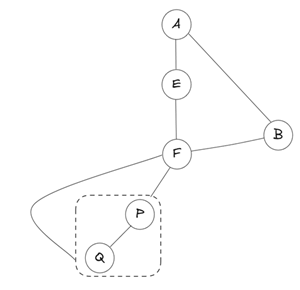

参考:

* https://oi-wiki.org/graph/bcc/#%E7%82%B9%E5%8F%8C%E8%BF%9E%E9%80%9A%E5%88%86%E9%87%8F

双连通分解针对**无向图**。

这个也是 Tarjan 算法，和 Tarjan 算法求强连通分量很类似。

在无向图中，若删除节点 $v$ 后连通分量增多，则 $v$ 称为**割点**或**关节点**。

不含任何关节点的图称为**双连通图**。

双连通图的含义是什么？“双”字是什么意思？

双连通图没有关节点，意味着删除其中任意一个顶点后，剩余子图仍然连通。**点是有冗余的，至少要删两个点剩余子图才不连通**。

对于一个无向图中的 **极大** 点双连通的子图，我们称这个子图为一个 **点双连通分量（bi-connected component, bcc）**。

点双分量不能“跨过”原图的关节点，不然自己就有关节点了，扩展到关节点就不能再大了。

点双连通分解指分解出来各个点双连通分量。

**TODO**: 还有[边双连通分量](https://oi-wiki.org/graph/bcc/#%E8%BE%B9%E5%8F%8C%E8%BF%9E%E9%80%9A%E5%88%86%E9%87%8F)

## 点双连通分量的性质

* 一个**非割点**：只会落在 **恰好一个点双** 中。

* 一个**割点**：会被重复放进多个点双里，因为它是连接这些点双的“关节”。必然出现在 **至少两个不同的点双连通分量** 里。

  * 换句话说，点双分解是允许割点重叠的。

---

[oiwiki](https://oi-wiki.org/graph/bcc/#tarjan-%E7%AE%97%E6%B3%95)上给出的性质：

1.  两个点双最多只有一个公共点，且一定是割点。
2.  对于一个点双，它在 DFS 搜索树中 dfn 值最小的点一定是割点或者树根。

我们根据第二个性质，分类讨论：

1.  当这个点为割点时，它一定是点双连通分量的根，因为一旦包含它的父节点，他仍然是割点。
2.  当这个点为树根时：
    1.  有两个及以上子树，它是一个割点。
    2.  只有一个子树，它是一个点双连通分量的根。
    3.  它没有子树，视作一个点双。

## 过程

过程非常类似求强连通分量的 Tarjan ，一个节点 $u$ 的子树 $v$ ，当发现子树 $v$ 到不了 $u$ 的真祖先时（指整棵子树 $v$ 没有后向边能到达 $u$ 的真祖先，这意味着删掉 $u$ ，下面一定会断开），那么说明这一支的点双分量只能向上扩展到 $u$ 。更进一步，如果此时 $u$ 不是全树根，则 $u$ 一定是割点，如果是树根还不好说，得看其树边分支数，但无论是哪种，找点双分量的扩展操作都只能到 $u$ ，要么因 $u$ 是割点而不能继续扩展，要么因为 $u$ 为全树根，上面没有点了而不能继续扩展。

这里不像强连通分量 Tarjan 一样是在 $u$ 递归返回后看是否 `dfn[u] == low[u]` ，然后记录强连通分量。强连通分量 Tarjan 是要找 SCC 根，然后整个下面相关节点构成一个 SCC。但是 BCC Tarjan 是: $u$ 的左侧树边可能出一个 BCC ，右侧树边也可能出一个 BCC，所以是在 `for (int v : g[u])` 内部，一旦 $u$ 的一个子树方向发现子树 $v$ 到不了 $u$ 的真祖先后，马上就可以构造出一个 BCC 。

然后代码还有对根的特殊判断，如果是非根(上面有节点) $u$，子树到不了 $u$ 的真祖先，由于 $u$ 一定有真祖先，所以删除 $u$ 一定会导致隔离， $u$ 一定为割点。

但如果 $u$ 为全树根，那么其本来就没有真祖先，`low[v] >= dfn[u]` 总是成立的，**树根是否为关节点对于“扩展分量到关节点，从而找到BCC”并不重要，不辨明也可以BCC分解**。但是由于 $u$ 没有真祖先，虽然看起来后代到不了上面，但是其实删除 $u$ 也不一定导致隔离，所以**树根是否为关节点的判断要单独看根的树边分支数**。

这里树边分支数的描述是指，例如 $u$ 有两个分支出去，但是下面这两个连通分量是连着的，实际就一个连通分量，所以 $u$ 出去的两条边只有一条是树边，另外一条是后向边。

代码中 BCC 的分解不依赖于是否为割点的判断结果。

## 关于两个细节

### 出栈时为什么不能改成直到 $u$ 出栈，然后把 $u$ 重新入栈

即

```cpp
// ✅
if (low[v] >= dfn[u]) {
    if (u != root || child >= 2) cut[u] = true;
    vector<int> component;
    int node;
    do { // 出栈直到 v 出去
        node = st.top(); st.pop();
        component.push_back(node);
    } while (node != v);
    component.push_back(u);
    bcc.push_back(component);
}
```

为什么不能改成

```cpp
// ❌
if (low[v] >= dfn[u]) {
    if (u != root || child >= 2) cut[u] = true;
    vector<int> component;
    int node;
    do { // 出栈直到 u 出去
        node = st.top(); st.pop();
        component.push_back(node);
    } while (node != u);
    st.push(u); // u 重新推回去
    bcc.push_back(component);
}
```

不能采用后者说明 $v$ 出栈后，下一个栈顶不一定是 $u$ ，这是可能发生的。考察这个图：



递归顺序这样来，$A \rightarrow E \rightarrow F \rightarrow B$，此时栈中暂存的节点为 $< BFEA ]$ ，B 发现自己能通过后向边到达 A。B 返回到 F 之后，F 发现 F-B 这条树边的 B 能到达自己的真祖先，所以不会报告 BCC。现在还没到回溯到 A 的时候，接着轮到 F 继续递归。

然后，我们这里简单化，F 左下只有一个节点 P ，P 返回后，F 发现这条 dfs 树中到不了自己的真祖先，说明 F 就是一个 BCC 的一端边界，{F, P} 为一个 BCC。但是，栈中却是 $< PBFEA ]$ ，虽然 BCC 里 P 下一个确实该就是 F，但是**栈中却被 P 的兄弟隔开了 {P, F}** ，所以，退栈只能退到 P，然后再手动给点双分量加上 F 。

### 为什么点双分解Tarjan的else分支必须用 dfn[v]

点双分解Tarjan代码中的：

```cpp
else {
  low[u] = std::min(low[u], dfn[v]);
}
```

为什么不能改成 `low[u] = std::min(low[u], low[v]);`

（强连通分解Tarjan这个位置是两种写法都可以，点双分解Tarjan这个位置必须要用 `dfn[v]`）

还是用上面那个图，这次 P, Q 都有。

当 B 回溯到 F 后，F 知道自己能到达 A , low[F] 变成了 A 。而对于 Q - F 这条后向边，如果写 low[u] = std::min(low[u], low[v]); Q 会认为自己也能到 A，然后回溯到 F 时，F 发现自己的后代能到达自己的真祖先 A ，会认为自己不是割点。但是实际上 F 是割点，删掉 F ，原本 Q 到 A 的方式便不复存在了。也就是说，**Q 能到 F 的真祖先 A 是依赖了关节点 F 的**，所以只能用 `dfn[v]` 更新自己，不能用 `low[v]` 。