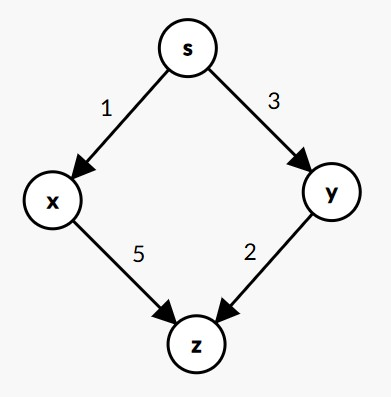
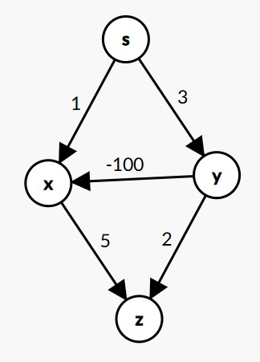
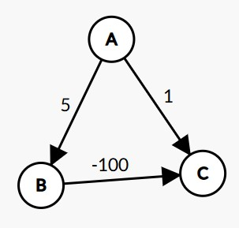

## Dijkstra算法为什么不能处理含负权边的图
[LeetCode3419. 图的最大边权的最小值](https://leetcode.cn/problems/minimize-the-maximum-edge-weight-of-graph/description/)中遇到了一个Dijkstra算法变式的解法，又想了下Dijkstra算法为什么不能处理含负权边的图，然后发觉有些情况下是可以处理的，这里记一下。[这个链接](https://www.zhihu.com/question/21620069/answer/24518138)能作为结论佐证。

Dijkstra算法求最短路径的过程中(以有向图为例)，若x先出队，y后出队，且x到z和y到z都有边，那么x松弛z和y松弛z都是必要的，比如 1 + 5 会大于 2 + 3。若y到x有一条边(权>=0)，那么由y松弛x一定不会产生更新(x先出队，y后出队，一定有 $d_x \le d_y + w$ )，出队的节点能对邻居产生更新，但不会对前面就出队了的节点产生更新，Dijkstra的"一锤子买卖"(贪心)成立，节点首次出队时得到的就是其最短距离。

但若y到x有一条负权边，那么绕一段路先到y再到x可能比直接到x的距离更小，x第一次出队时得到的不再是x的最短距离，负权边使得"一锤子买卖"不成立了，所以x还是需要更新，且由于x发生了更新，x的邻居也需重新更新。

朴素实现的Dijkstra算法代码不会重新更新x，所以会给出错误结果。

优先队列实现的Dijkstra算法代码，若果真有负权边，会去重新更新 x (这里指`if (d > dis[node]) continue;`的剪枝写法，而非用`vis`)，但是负权边的存在使得一个节点可能被同一条边多次引入，时间复杂度变得不再可控，

若是无向图，负权边会相当于一个环，y-x会反复互相拉对方进队，算法无法结束。
        
若是有向图，若有负权环，同样会产生无限互拉的情况；若无负权环，是能获得正确结果的，因为优先队列实现的Dijkstra本身和暴力枚举很接近([LeetCode1928. 规定时间内到达终点的最小花费](https://leetcode.cn/problems/minimum-cost-to-reach-destination-in-time/description/))，但是时间复杂度不可控。

注意，优先队列Dijkstra里的剪枝代码的两种写法`if (d > dis[node]) continue;`和`if (vis[u]) continue;vis[u] = true;`，在边权非负的情况下效果一样，但是若有负权边，前者允许节点被负权边更新得更小后重新入队，而后者不允许(因而无法给出正确结果)。上面所说的能获得正确结果的情景是:

**结论: 含负权边但无负权环的有向图，允许一个节点在首次出队后重新入队，那么优先队列Dijkstra是能得到正确结果的，但时间复杂度不可控。**

**注意: 优先队列Dijkstra算法是会发生一个节点多次入队的情况的，例如x和y都可能去松弛z，但在边权都非负的情况下，无论上面哪种剪枝写法，都不会发生节点在首次出队后需要重新入队的情况，因为后面出队的节点的距离一定更大，再加上一条边距离更大，不会把前面节点再拉进队。所以边权非负时，两种剪枝写法都无需讨论是否允许重新入队，因为肯定不会发生需要重新入队的情况。**

### 为什么Dijkstra算法求最短路径，当有负权边时不能：把所有边加上abs(最小边权)，化为普通情况处理？

有向图有3个节点ABC，A->B=5，A->C=1，B->C=-100，5 + (-100) < 1，则A->C最短距离为-95；边都加上100，A->B=105，A->C=101，B->C=0，105 + 0 > 101，不等式直接反向了，A->C最短距离为101，变回去得到A->C最短距离是1(错误)。关键点在于上面不等式左边有两个加数，右边只有一个，左边加了2个100，右边只加了1个100，直接把不等式反向了。